# Poke-app 

https://poke-app-pablo.netlify.app/

# Technical part

This is a app of react.js whit 22 components and git control versions.

- ### React.js  {hooks: [ useForm, useState, useContext, useParams, useScreenSize]}
- ### Testing whit JEST
- ### API handling with four levels of nesting and passing through urls
- ### Axios
- ### RegEx
- ### react-svg-radar-chart
- ### Mobile first
- ### SASS
- ### Styled-Components
- ### normalize.css
- ### react-router-dom
- ### uuid
- ### create-react-component-folder
- ### netlify-cli
<!-- - ### Cariño, esfuerzo y logica. -->

## Atention:
The application was initially designed with useContext instead of useState because its dimensions were still being studied, the changes can be observed in the changeContext-ToState and Improvements branches.

## `npm test`

I like to check that my applications not only do what they are supposed to do, but also that they don't do what they are not supposed to do. Run the npm test command and wait. Press a key when the console prompts, then you will see an image like this:
You can see in each component the snapshot with all small tests that each test does.

[Running tests](https://facebook.github.io/create-react-app/docs/running-tests) for more information.

# Visual part

## home

This application will allow you can see from the pokemon with the index 1 to 151. You can see them in home.

I get the photo of the pokemon from the API but I add the background image by mapping it according to the type of pokemon
 

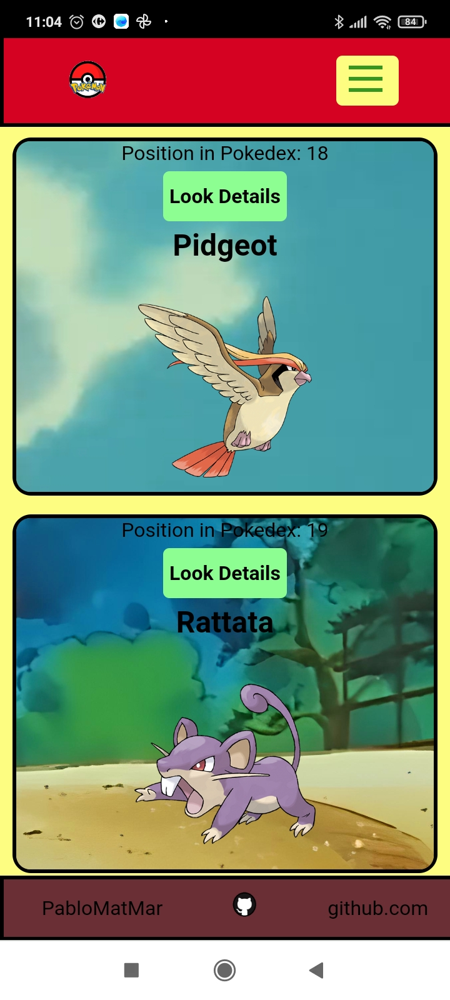
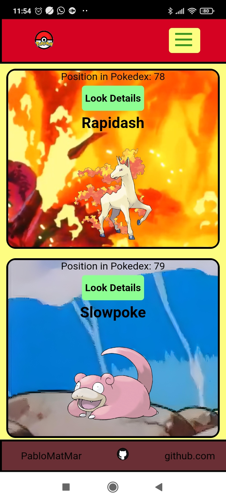
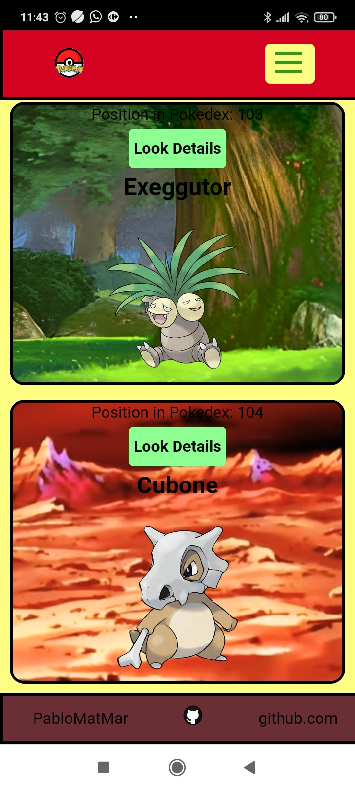
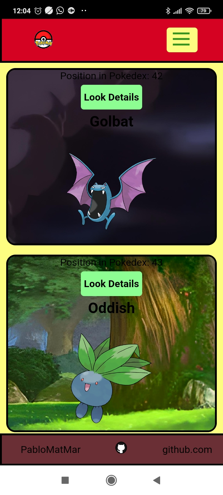
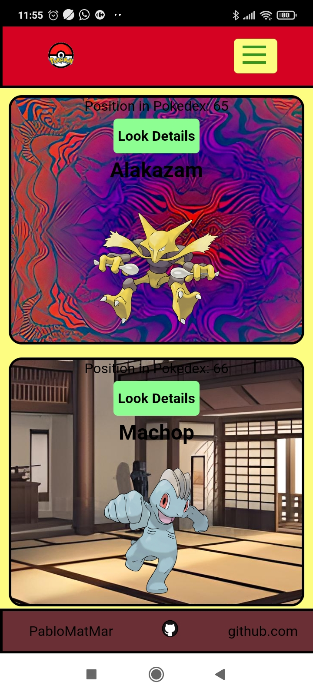
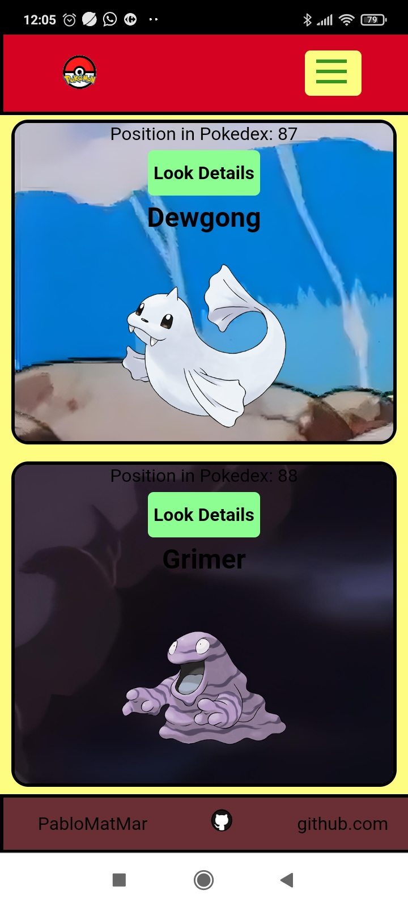

 

## Details

In each pokemon you can click on button details, this will take you to the /pokemon/:id route or pokemon/local/:id if the pokemon was created. You will see:
- Choose drawing style and normal or shiny shape of the image (<strong><b><i>hook and onChange magic</i></b></strong>):
 

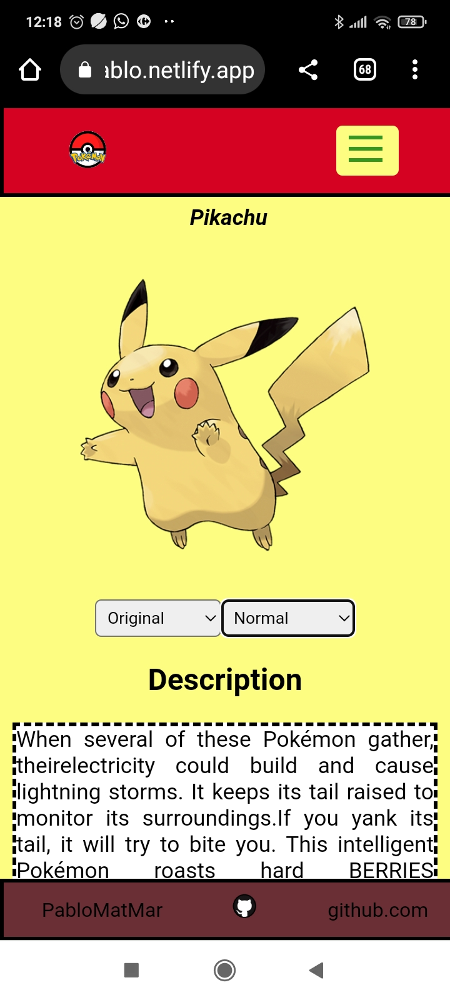
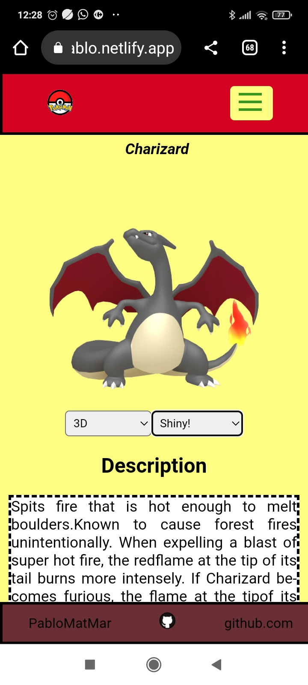
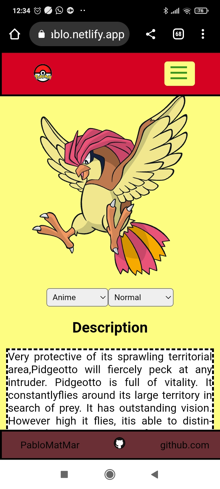

- The description was separated into fragments(game version) in the api. They are mixed according to language, repeated and contained non-alphabetic characters. The data has been
treated <strong><b><i>(map, filter, replace, regEx...)</strong></b></i> and here we have them all in a nice text!:
 

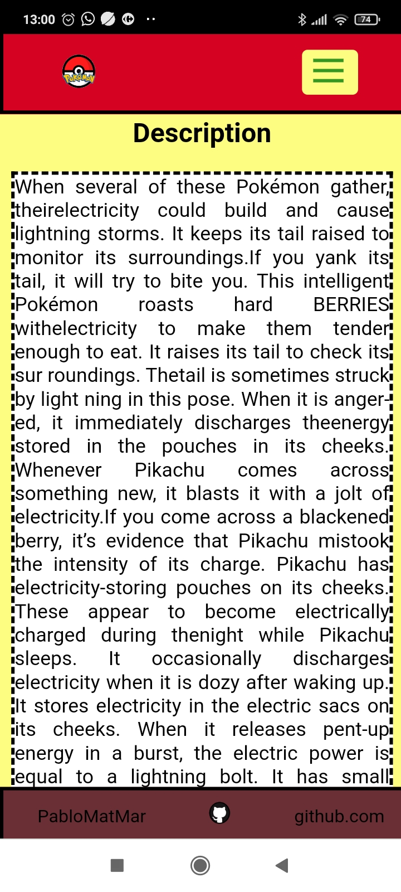
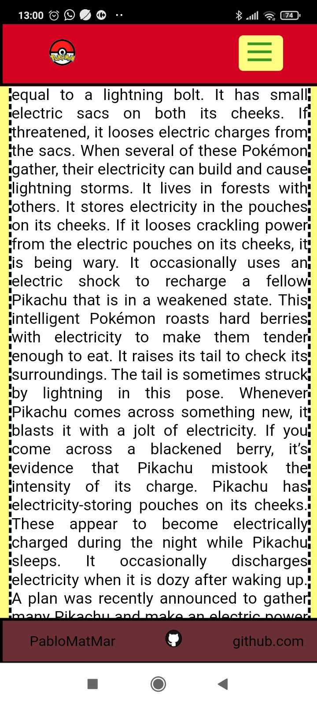
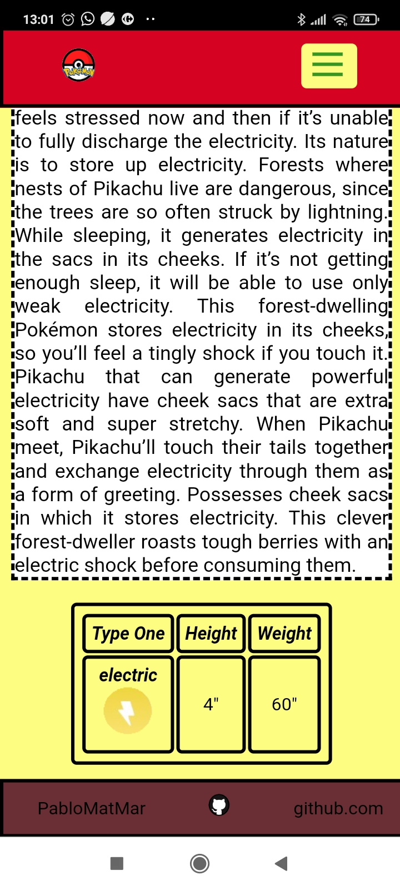

- A graph in which to see their stats. The limits of the graph have been defined by obtaining in a two-dimensional array the scores of all the pokemon and choosing the highest in each stat <strong><b><i>(context, map, sort, for...)</strong></b></i>
 

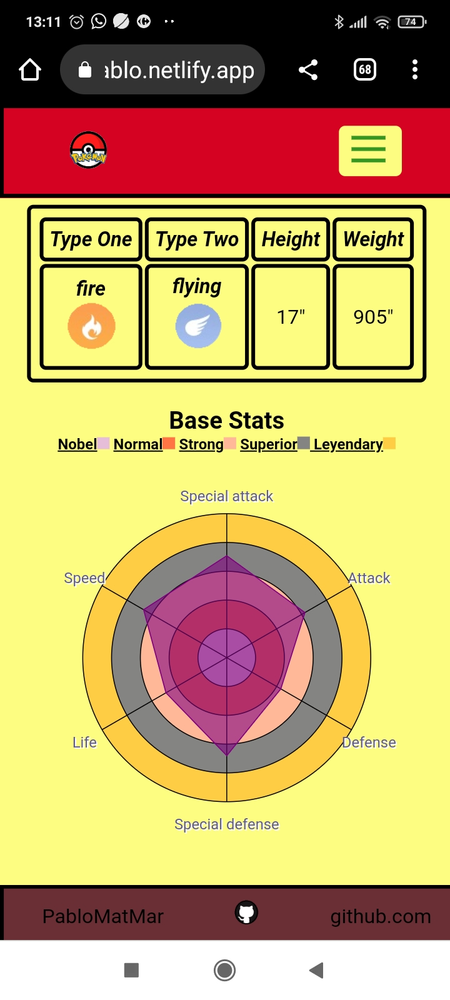

- A table with all the movements of the pokemon and if you click (API callback through link) on the link you will see the normal and special effects (API callback through link) of the movement:
 

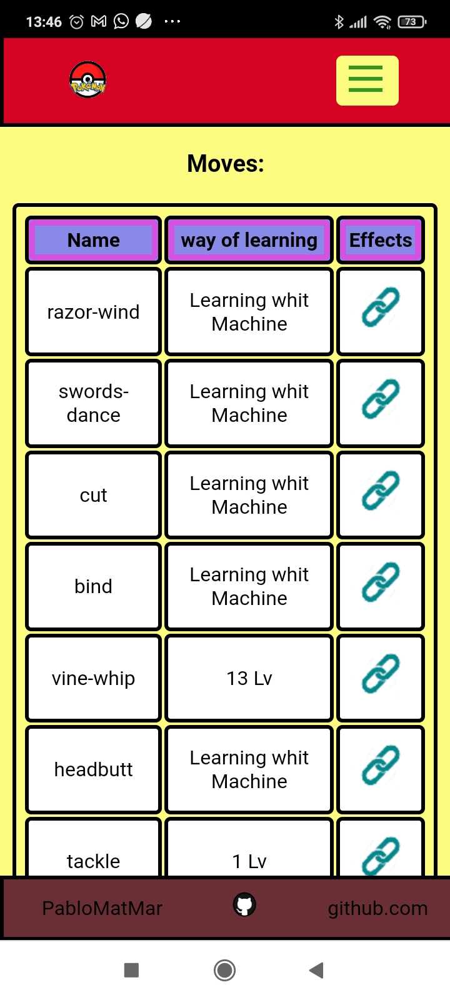
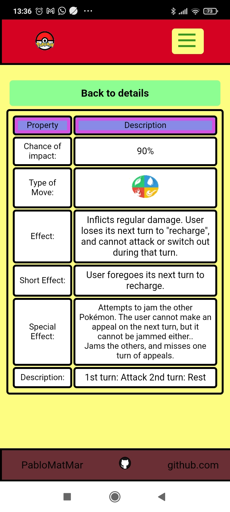

 
 

## Search

Through the nav-bar you can go to Search. There you can write the name of the pokemon you want to search for (There are more than 900!) It works with <strong><b><i>Debounce</strong></b></i>, so after finishing writing you will only have to wait 4 seconds for the pokemon to appear. You can also look at details of the searched pokemon.
 

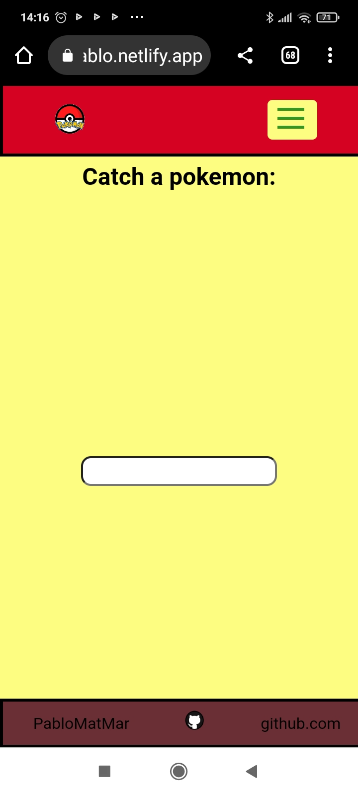
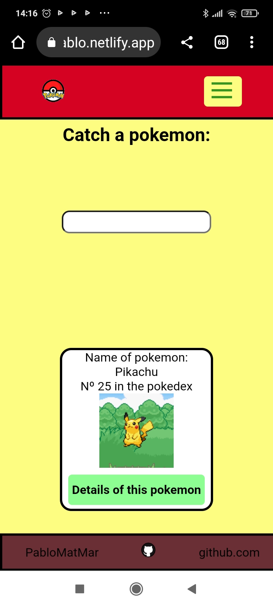
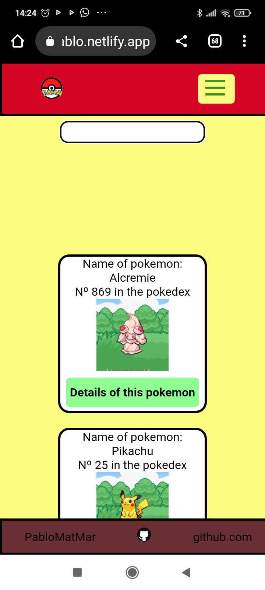

You can continue browsing the page, your pokemon will be captured thanks to <strong><b><i>context!</strong></b></i>

 
 

## Add a pokémon

Finally, if you want to have more fun, you can add a new <strong><b><i>(useForm)</strong></b></i> pokemon through the navigation bar, here you can create a pokemon with just the basics or adding all the details. This will be done in the home list and you will be redirected <strong><b><i>(navigate of react router dom)</strong></b></i> there when you created it. The feel basic to create are in red color.
 

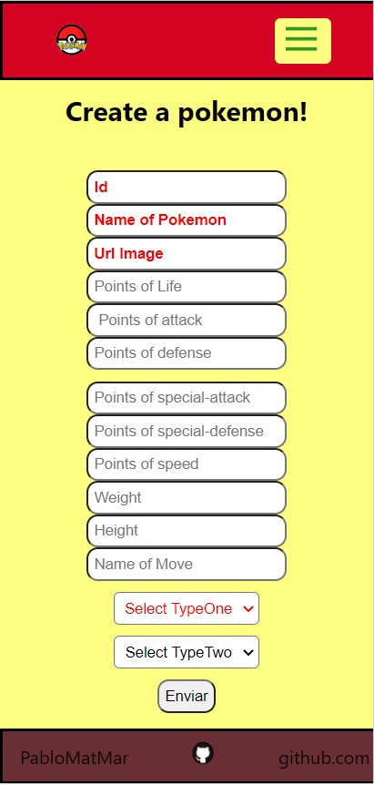
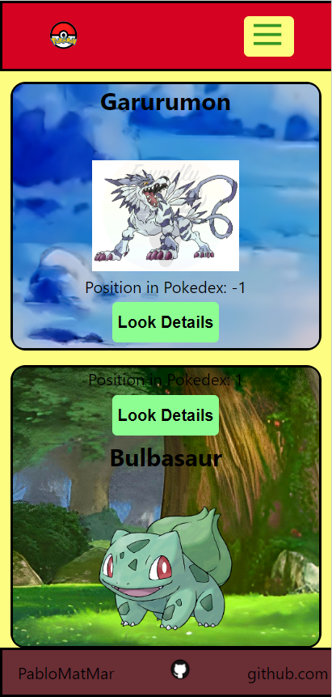

 
 

## Nav-Bar

In the nav-bar, in addition to the routes, you can select songs from the first pokemon session!
 

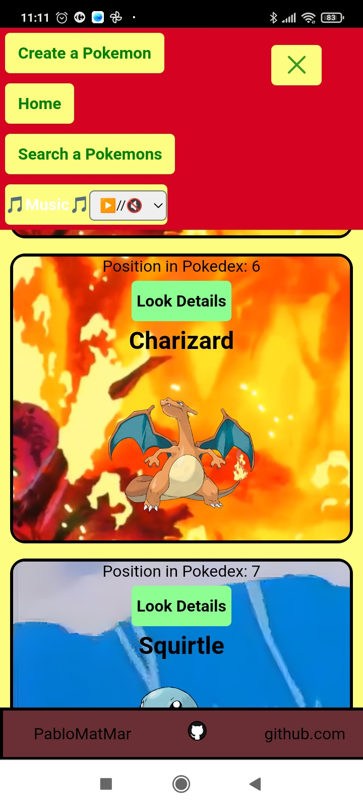

## Responsive
I invited you to make git clone or fork and check this 😉

# Available Scripts

In the project directory, you can run:

### `npm start`

Runs the app in the development mode.\
Open [http://localhost:3000](http://localhost:3000) to view it in your browser. (First time you need run `npm i` to install dependencies)

The page will reload when you make changes.\
You may also see any lint errors in the console.

### `npm test`

Testing whit jest!