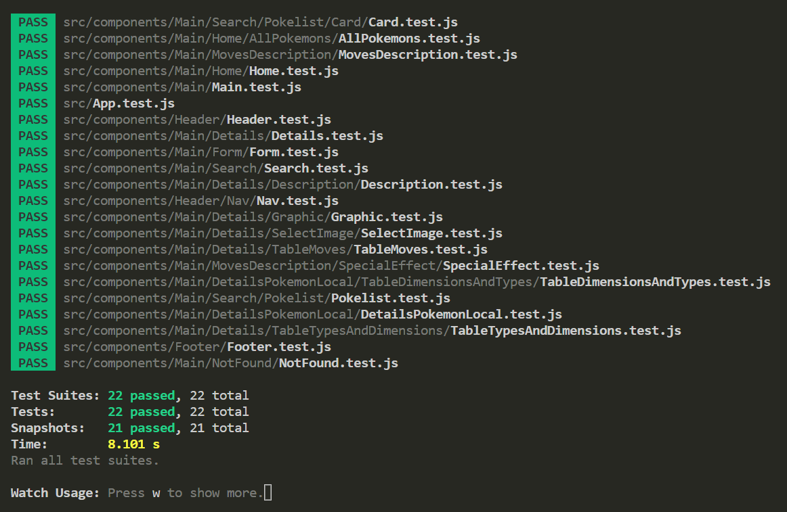

# Poke-app 

https://poke-app-pablo.netlify.app/

- ### React.js
- ### Mobile first
- ### Testing whit JEST
- ### SASS
- ### Styled-Components

## home

This application will allow you can see from the pokemon with the index 1 to 902. You can see them in home.
 

 

## Details

In each pokemon you can click on details, this will take you to the /pokemon/:id route or pokemon/local/:id if the pokemon was created. In it you can choose with what style of drawing you can see the pokemon, and if you want to see the normal or shiny way. You will also see:
- Their typologies
- Your size and weight
- His attacks

 

 

## Search

In the nav-bar you can go to the search section in the /search route, there you can put the name of the specific pokemon you are looking for, from there you will also have access to details.
 

 

## Add a pokémon

Finally if you want to have more fun you can go add a new pokemon in the /new route through the nav bar button add a new pokemon, here you can create a pokemon only with the basics or adding all the details. This will be included in the home list and you redirected to over there when you created it.
 

 

# Available Scripts

In the project directory, you can run:

### `npm start`

Runs the app in the development mode.\
Open [http://localhost:3000](http://localhost:3000) to view it in your browser. (First time you need run `npm i` to install dependencies)

The page will reload when you make changes.\
You may also see any lint errors in the console.

### `npm test`

I like to check that my applications not only do what they are supposed to do, but also that they don't do what they are not supposed to do. Run the npm test command and wait. Press a key when the console prompts, then you will see an image like this:
You can see in each component the snapshot with all small the tests that each test does.

[running tests](https://facebook.github.io/create-react-app/docs/running-tests) for more information.

### `npm run build`

Builds the app for production to the `build` folder.\
It correctly bundles React in production mode and optimizes the build for the best performance.

### `netlify deploy --prod`

Deploys the app in the prod url, so it's available. The command will require you:
-Choice "Link this directory
 to an existing site" and choice again "poke-app-pablo"
-Include the directory in which the app's build is in. In this case, the directory is ./build.